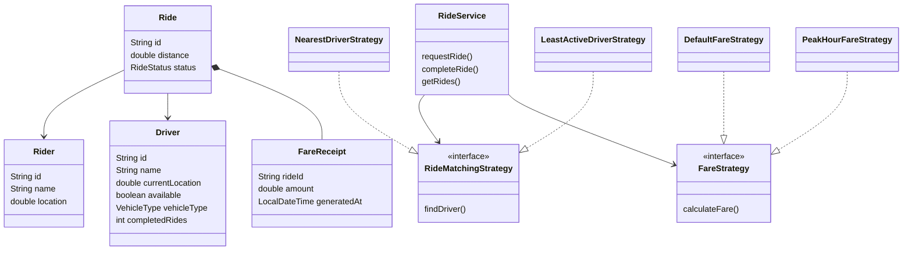

# Class Model

Package root: `com.airtribe.ridewise`

```
src/main/java/com/airtribe/ridewise/
├── Main.java
├── model/
│   ├── Rider.java
│   ├── Driver.java
│   ├── Ride.java
│   ├── FareReceipt.java
│   ├── RideStatus.java
│   └── VehicleType.java
├── strategy/
│   ├── RideMatchingStrategy.java
│   ├── NearestDriverStrategy.java
│   ├── LeastActiveDriverStrategy.java
│   ├── FareStrategy.java
│   ├── DefaultFareStrategy.java
│   └── PeakHourFareStrategy.java
├── service/
│   ├── RiderService.java
│   ├── DriverService.java
│   └── RideService.java
├── exception/
│   └── NoDriverAvailableException.java
└── util/
    └── IdGenerator.java
```

## Entities

| Class | Fields | Notes |
| --- | --- | --- |
| `Rider` | id, name, location | location is a number used for nearest matching |
| `Driver` | id, name, currentLocation, available, vehicleType, completedRides | completedRides supports least-active matching |
| `Ride` | id, rider, driver, distance, status, fareReceipt | status starts REQUESTED, becomes ASSIGNED on match |
| `FareReceipt` | rideId, amount, generatedAt | created on complete |
| `RideStatus` | REQUESTED, ASSIGNED, COMPLETED, CANCELLED | enum |
| `VehicleType` | BIKE, AUTO, CAR | enum |

## Strategies

| Type | Contract |
| --- | --- |
| `RideMatchingStrategy` | `Driver findDriver(Rider rider, List<Driver> drivers)` |
| `NearestDriverStrategy` | available driver with smallest `|driver.location - rider.location|` |
| `LeastActiveDriverStrategy` | available driver with fewest `completedRides` (first in list on ties) |
| `FareStrategy` | `double calculateFare(Ride ride)` |
| `DefaultFareStrategy` | `50 + 10 * distance` |
| `PeakHourFareStrategy` | same formula × 1.5 during 08–11 and 17–21 |

## Services and collaborators

| Class | Methods | Depends on |
| --- | --- | --- |
| `RiderService` | registerRider, getRiderById | `IdGenerator` |
| `DriverService` | registerDriver, getDriverById, updateAvailability, listAvailableDrivers | `IdGenerator` |
| `RideService` | requestRide, completeRide, getRides | RiderService, DriverService, RideMatchingStrategy, FareStrategy |
| `IdGenerator` | nextId(prefix) | — |
| `NoDriverAvailableException` | runtime exception | thrown when matching returns null |
| `Main` | console menu | all three services; constructs `NearestDriverStrategy` + `DefaultFareStrategy` |


