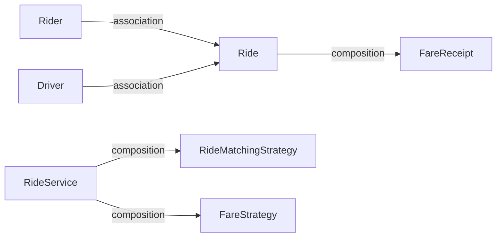

# Object Relationships

| Relationship | Type | Meaning in RideWise |
| --- | --- | --- |
| Rider → Ride | Association | A ride points at the rider who requested it. Rider and ride have independent lifetimes. |
| Driver → Ride | Association | A ride points at the assigned driver. A driver exists before assignment and after complete. |
| Ride → FareReceipt | Composition | The receipt is created for that ride on complete (`rideId`, attached on `Ride`). It is not shared. |
| RideService → Strategies | Composition | RideService *has* a matching strategy and a fare strategy (constructor injection). |

## Association vs composition here

- **Association:** Rider and Driver are registered independently. A ride *uses* them. Completing a ride does not delete the rider or driver; the driver is marked available again.
- **Composition (Ride–Receipt):** No receipt exists without a completed ride. The receipt’s identity is the ride id.
- **Composition (Service–Strategies):** RideService does not inherit matching or pricing. It holds references to strategy objects. Swap the objects in `Main` to change behavior.

## Runtime flow

1. `Main` constructs `RiderService`, `DriverService`, one matching strategy, one fare strategy, then `RideService`.
2. Request ride: load rider → list available drivers → `matchingStrategy.findDriver` → assign driver → status `ASSIGNED`.
3. Complete ride: `fareStrategy.calculateFare` → new `FareReceipt` → status `COMPLETED` → driver available, `completedRides++`.
